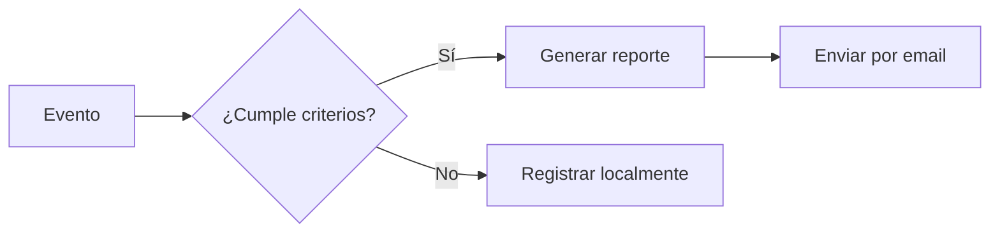

ActivityLogger

# Documentación Técnica del Sistema de Monitoreo

## 📂 Estructura del Proyecto
```plaintext
monitor_actividades/
├── logs/
│   ├── activity.jsonl       # Logs en JSON Lines
│   └── reporte_diario.txt   # Resumen legible
├── src/
│   ├── core/                # Módulos principales
│   ├── config/              # Archivos de configuración
│   └── utils/               # Herramientas auxiliares
├── requirements.txt         # Dependencias
└── README.md                # Guía de instalación
```

## ⚙️ Configuración (ejemplo genérico)
```python
# config/settings.py
DEFAULT_CONFIG = {
    'logging': {
        'max_size_mb': 50,
        'backup_count': 5,
        'log_path': "/ruta/segura/para/logs"
    },
    'monitoring': {
        'window_check_interval': 2.0,
        'clipboard_check_interval': 0.5
    }
}
```

## 🔍 Funcionalidades Principales

### 1. Sistema de Monitorización
| Componente | Frecuencia | Datos Capturados |
|------------|------------|------------------|
| Ventanas   | 2 segundos | Nombre app, título, categoría |
| Portapapeles | 500ms | Tipo contenido, longitud |
| Teclado    | Eventos | Conteo caracteres, timestamps |

### 2. Categorización Automática
```python
# core/categorization.py
PRODUCTIVE_APPS = ['vscode', 'pycharm', 'outlook']
NON_PRODUCTIVE_APPS = ['steam', 'spotify', 'social']
```

### 3. Gestión de Logs
- **Rotación automática** al alcanzar límite de tamaño
- **Formato estandarizado** (JSON Lines + texto plano)
- **5 niveles de backup** (compresión opcional)

## 📨 Módulo de Notificaciones


## 🛠️ Requisitos Técnicos
```bash
# requirements.txt
psutil==5.9.0
pynput==1.7.6
pywin32==306
python-dotenv==0.19.0
```

## 🚀 Guía Rápida de Implementación

1. **Configuración inicial**
```bash
cp config/sample_settings.py config/local_settings.py
```

2. **Variables de entorno**
```plaintext
.env.example:
LOG_PATH=/ruta/absoluta/para/logs
SMTP_SERVER=smtp.proveedor.com
```

3. **Ejecución**
```bash
python -m src.main --mode=prod
```

## ⚠️ Consideraciones Legales
- Requiere **consentimiento explícito** del usuario monitorizado
- Recomendado para:
  - Entornos laborales (con políticas claras)
  - Uso educativo (con supervisión)
  - Auditorías de seguridad

## 🔄 Workflow de Desarrollo
1. Modificar configuración → 2. Probar localmente → 3. Validar logs → 4. Desplegar


## ⚖️ Licencia y Uso Responsable

Este software está diseñado para **monitoreo personal** 


*Documentación generada para el Sistema de Monitoreo de Actividades - Versión 1.0*
